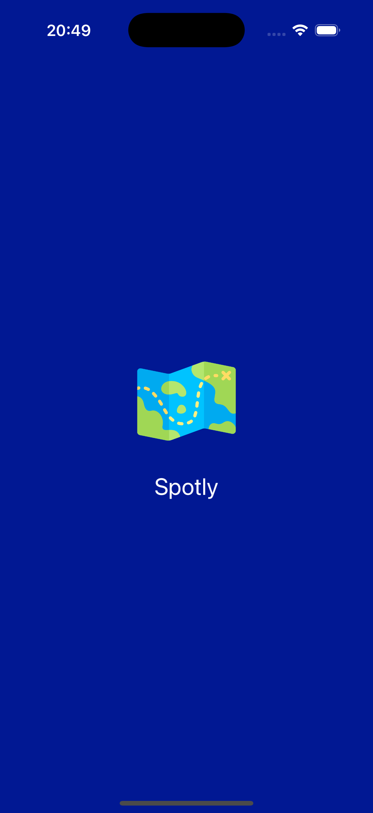
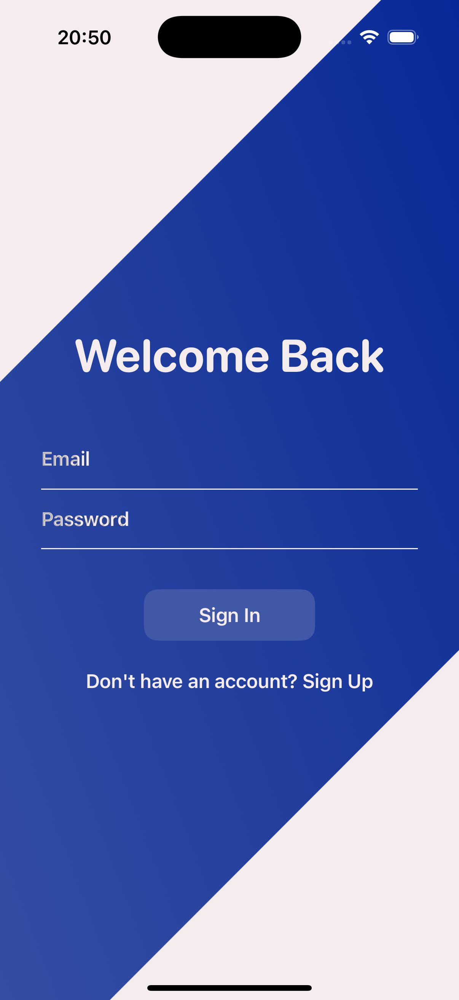
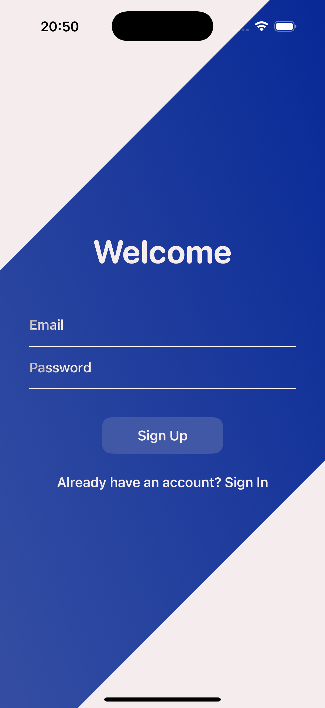
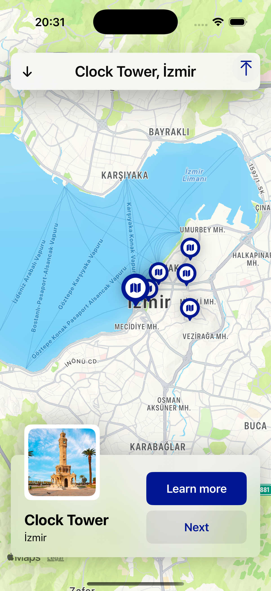
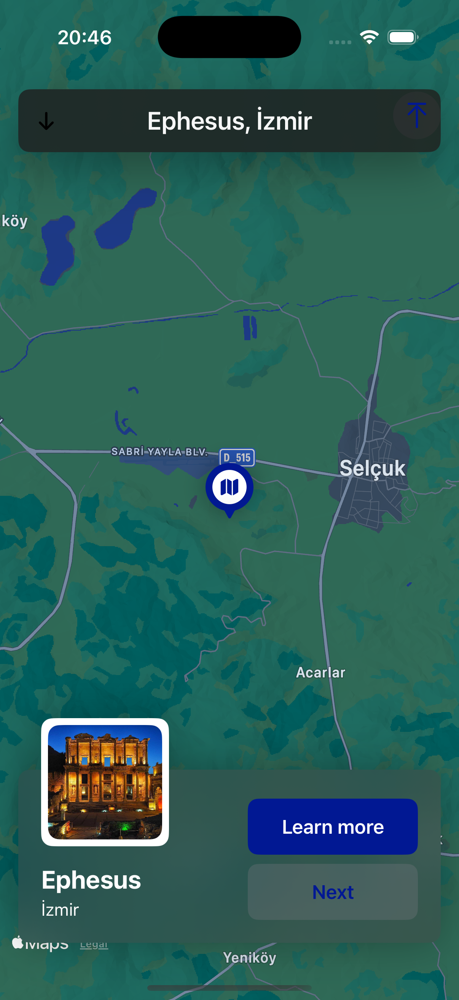
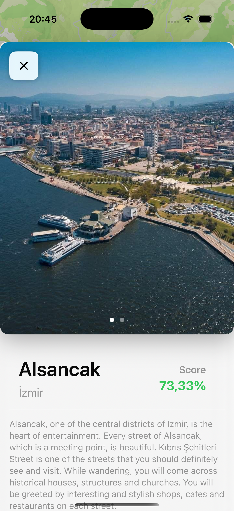
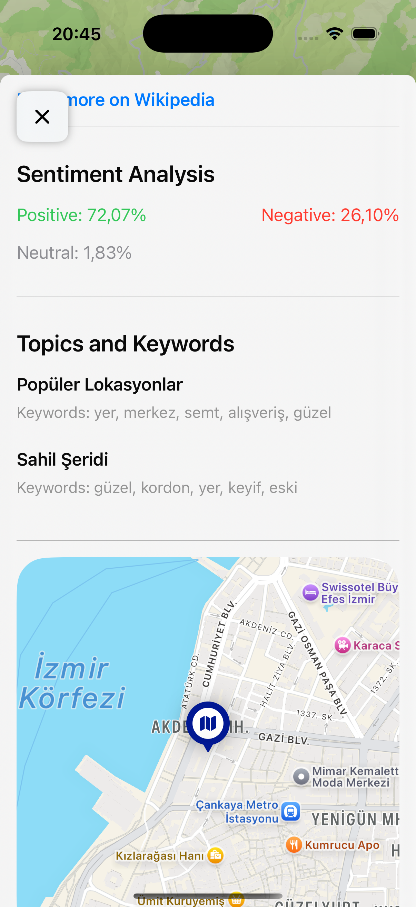
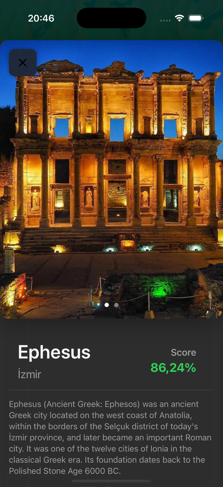
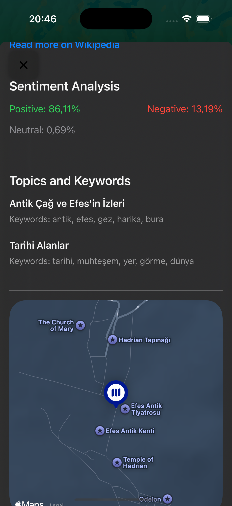

# Spotly

Spotly is an iOS application developed using SwiftUI that helps travelers explore tourist destinations through sentiment analysis and topic modeling. The app uses **BeautifulSoup** for web scraping to gather reviews from **TripAdvisor**, analyzes them with **BERTurk** (a pre-trained Turkish BERT model), and applies **Latent Dirichlet Allocation (LDA)** for topic modeling. The results, once scraped and analyzed, are stored as static data to be used for making recommendations and providing insights to users. **Firebase** is used for managing user accounts and storing preferences securely.

## 🎥 Demo Screenshots

You can view the demo screenshots of the application below:

### **Splash Screen, Sign In, Sign Up, and Onboarding (Common Color)**

| **Screen**             | **Image**                                            |
|------------------------|------------------------------------------------------|
| **Splash Screen**       |    |
| **Sign In**             |                |
| **Sign Up**             |                |
| **Onboarding Screen 1** |  |
| **Onboarding Screen 2** |  |
| **Onboarding Screen 3** |  |

### **Map View**

| **Mode**             | **Light Mode**                                      | **Dark Mode**                                      |
|----------------------|-----------------------------------------------------|----------------------------------------------------|
| **Map View**          |   |    |

### **Detail View**

| **Mode**             | **Light Mode**                                      | **Dark Mode**                                      |
|----------------------|-----------------------------------------------------|----------------------------------------------------|
| **Detail View**       |      |   |

                                             

## 📱 Features

- **Splash Screen and Onboarding:** When the app is launched, users first see a splash screen followed by onboarding screens that introduce the app’s features and guide them through the user experience.
- **Sign In and Sign Up:** After the onboarding, users are prompted to either sign in to their existing account or sign up to create a new one. User authentication is securely managed using **Firebase**.
- **Static Review Data:** Spotly utilizes previously collected and analyzed review data from **TripAdvisor**. This data is not dynamic but stored statically for quick access and analysis.
- **Review Analysis:** Sentiment analysis on the stored review data is performed using **BERTurk** to classify reviews as positive, neutral, or negative.
- **Topic Modeling with LDA:** **Latent Dirichlet Allocation (LDA)** is used to identify the most discussed topics within the stored reviews (e.g., "staff", "food", "attractions").
- **Personalized Recommendations:** Based on sentiment scores and extracted topics, Spotly provides recommendations for tourist spots based on the analysis of previously gathered data.
- **Map Integration:** Tourist spots are displayed on an interactive map with the stored review analysis and sentiment results.
- **Dark Mode Support:** The app adapts seamlessly to both **Light Mode** and **Dark Mode** for a comfortable user experience in different environments.
- **Pre-Processed Data:** All review data is pre-processed and stored in a static format, meaning the application does not rely on real-time scraping or updates.

## 🚀 Technologies and Libraries

- **SwiftUI:** A modern and declarative UI framework for building the user interface.
- **MapKit:** Used to render maps, display user location, and show tourist spots.
- **CoreLocation:** Fetches the user's current location for map integration and nearby tourist recommendations.
- **BeautifulSoup (Python):** Web scraping library to gather review data from TripAdvisor.
- **BERTurk:** A pre-trained BERT model for Turkish sentiment analysis.
- **Latent Dirichlet Allocation (LDA):** Topic modeling used to extract and categorize review topics.
- **Combine:** Used for managing data streams and UI updates reactively.
- **UIKit (UIViewRepresentable):** Bridges the gap between SwiftUI and UIKit components for custom behaviors and map integration.
- **Firebase:** Firebase Authentication is used for user sign-in and sign-up, and Firebase Cloud Firestore is used for storing user preferences securely.

## ⚙️ Application Flow

### 1. **Splash Screen**
When the app is launched, a splash screen appears, displaying the Spotly logo and loading the necessary resources in the background.

### 2. **Onboarding Screens**
After the splash screen, the user is guided through onboarding screens that explain the key features of the app. The onboarding process highlights the sentiment analysis, personalized recommendations, and map visualization features of Spotly.

### 3. **Sign In / Sign Up**
Once the onboarding is completed, users are prompted to either sign in with their existing account or sign up for a new account. **Firebase Authentication** is used to handle the sign-in and sign-up process securely. This step is essential for saving user preferences and recommendations.

### 4. **Static Review Data**
Spotly uses **BeautifulSoup** to scrape tourist spot reviews from **TripAdvisor**. These reviews are then analyzed for sentiment using **BERTurk** and **LDA** for topic modeling. The results of this analysis are stored statically in the app, allowing users to quickly access and explore previously gathered insights.

### 5. **Review Sentiment Analysis**
The app performs sentiment analysis on the pre-processed reviews using **BERTurk**. Each review is classified into positive, neutral, or negative categories, providing users with an overall sentiment score for each tourist spot.

### 6. **Topic Modeling with LDA**
The app applies **Latent Dirichlet Allocation (LDA)** to identify common topics within the stored reviews. These topics are displayed to the user, helping them understand what aspects of a place are being praised or criticized (e.g., "food", "cleanliness", "staff").

### 7. **Map Visualization and Recommendations**
The app displays these tourist spots on an interactive map. Users can tap on a spot to see detailed reviews, sentiment scores, and topic discussions. Based on the sentiment analysis and topics, Spotly provides personalized recommendations for new places to visit based on the stored data.

### 8. **Dark Mode Support**
Spotly is designed to adapt to both **Light Mode** and **Dark Mode**, ensuring a pleasant visual experience regardless of the user's preferred mode.

### 9. **User Interaction**
Users can interact with the map, read reviews, explore topics, and use sentiment analysis to make better decisions on where to travel next.

## 📥 Installation

To install and run the project locally, follow these steps:

### 1. Clone the repository

```bash
git clone https://github.com/your-username/Spotly.git
